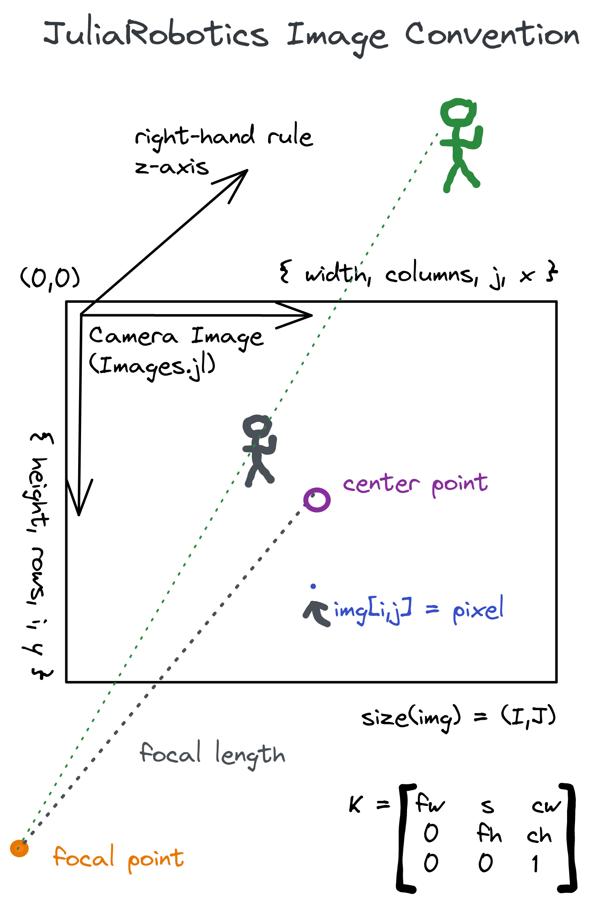

# NOTICE

This package is meant to consolidate the camera models previously found in the Julia package ecosystem.  There are still many gaps and community contributions are encouranged.

# CameraModels.jl
Basic Camera Models including pinhole, radial distortion etc.

> Click on badges to follow links:

| Stable Release | Dev branch | Coverage | Documentation |
|----------------|------------|----------|---------------|
| [![cms-ci-stb][cms-ci-stb-img]][cms-ci-stb-url]   [![version][cms-ver-img]][cms-rel-url] | [![cms-ci-dev-img]][cms-ci-dev-url] | [![cms-cov-img]][cms-cov-url] | [![cjl-slack-badge]][cjl-slack]   [![caesar-docs]][cjl-docs-url] |

# JuliaRobotics/CameraModels.jl Image Convention

The image convention is intended to be the best compromize between [JuliaImages's unified Array stack](https://github.com/JuliaImages/Images.jl), and established OpenCV conventions.  Also see [Augmentor.jl's Images description](https://evizero.github.io/Augmentor.jl/stable/images/#Working-with-Images-in-Julia), and open issues to help resolve miscommunication or convention issues.  The following figure is hosted in this repo, with raw image for easy update via [Excalidraw.com](docs/imgs/JuliaRoboticsImgConv.excalidraw).

# Roadmap

Project organization is currently done here:
- [https://github.com/orgs/JuliaRobotics/projects/9/views/1](https://github.com/orgs/JuliaRobotics/projects/9/views/1)

## Initial TODO List

- [x] Copy existing camera code from Caesar.jl and RoME.jl here,
- [x] Functional tests for consolidated CameraCalibration type
- [x] Implement radial distortion computations,
- [ ] Numerical tests for pinhole camera model,
- [ ] Homography point projections in 2D,
- [ ] Improve documentation,
- [ ] Integrate downstream with packages like AprilTags.jl and Caesar.jl
- [ ] Tests for radial distortion model,
- [ ] Homogeneous coordinates model,
- [ ] ...

## History

See NEWS.md.

[cms-ci-dev-img]: https://github.com/JuliaRobotics/CameraModels.jl/actions/workflows/ci.yml/badge.svg
[cms-ci-dev-url]: https://github.com/JuliaRobotics/CameraModels.jl/actions/workflows/ci.yml
[cms-ci-stb-img]: https://github.com/JuliaRobotics/CameraModels.jl/actions/workflows/ci.yml/badge.svg?branch=release%2Fv0.26
[cms-ci-stb-url]: https://github.com/JuliaRobotics/CameraModels.jl/actions/workflows/ci.yml
[cms-ver-img]: https://juliahub.com/docs/CameraModels/version.svg
[cms-rel-url]: https://github.com/JuliaRobotics/CameraModels.jl/releases
[cms-milestones]: https://github.com/JuliaRobotics/CameraModels.jl/milestones
[cms-cov-img]: https://codecov.io/github/JuliaRobotics/CameraModels.jl/coverage.svg?branch=master
[cms-cov-url]: https://codecov.io/github/JuliaRobotics/CameraModels.jl?branch=master

[caesar-docs]: https://img.shields.io/badge/CaesarDocs-latest-blue.svg
[cjl-docs-url]: http://juliarobotics.github.io/Caesar.jl/latest/

[cjl-slack-badge]: https://img.shields.io/badge/Caesarjl-Slack-green.svg?style=popout
[cjl-slack]: https://join.slack.com/t/caesarjl/shared_invite/zt-ucs06bwg-y2tEbddwX1vR18MASnOLsw
